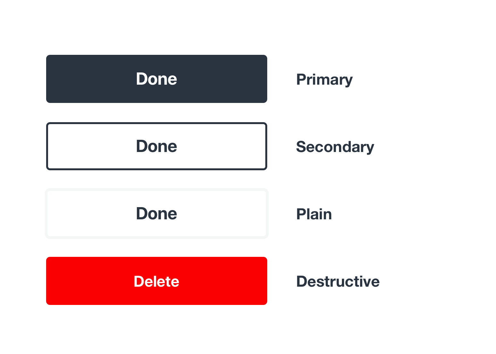
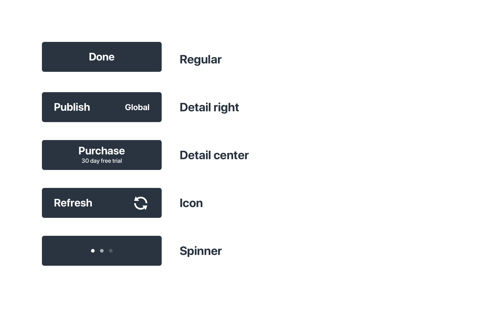
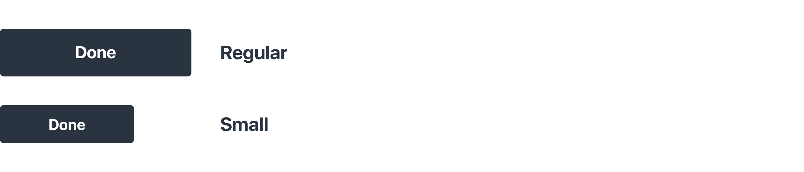
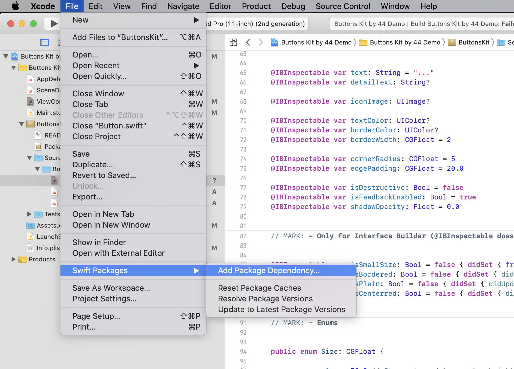

# Buttons Kit by 44

An easy to use collection of buttons for both designers and iOS developers. As a designer you get a Sketch document with symbols for the most common button variations. As a developer you get a toolkit written in Swift that supports the most common modern UI patterns. Since both designers and the developers gets editable versions (symbols and code), you can view this kit as a starting point for further developmen through your own extensions. 


## Designers

The Sketch file contains symbols for primary, secondary, plain and destructive buttons, ready to be thrown in to your project, resting assured that your developers won’t need to build anything from scratch.

The symbols include designs for four different styles, with five different layouts and two sizes each. All buttons include a spinner state.

### Styles



Buttons come in four main styles. A primary filled version, a secondary bordered, a plain with only text and a destructive one.

### Layouts



Each style supports five different layouts for different purposes. Two for additional detail, one with an icon and a spinner state.

View the Sketch symbols either as a complete package, or as a starting point. It’s up to you guys. Since the developer gets all the source code, any tweaks you make to the designs will be easy to implement into code.

Download the Sketch file to get started.


## Developers

The kit comes in a Swift Package with a single class that supports all variations of the design. All code can be edited as you see fit, so implementing tweaks should be straightforward.

Instantiate a button to your project either by placing a view in Interface Builder and changing its class to “Button”. Or programmatically through 👇

````
public convenience init(width: CGFloat, color: UIColor?, style: Button.Style?, size: Button.Size?)
````

You can edit the appearance of buttons either directly in Interface Builder or programmatically. The things you can tweak include the following 👇

* Text (duh)
* Detail text
* Icon
* Text color
* Border color
* Border width
* Corner radius
* Edge padding (for certain layouts)
* Size - regular or small
* Style - Filled, bordered, plain or destructive
* Layout - Regular, detail in center, detail to the right, icon

These parameters makes this button class highly customisable.

### Styles


* **Primary** Requries no action in IB, instantiate with nil for the style parameter programmatically.

* **Secondary** Set the “isBordered”* property to true in IB or instantiate with the bordered style programmatically.

* **Plain** Set the “isPlain”* property to true in IB or instantiate with the plain style programmatically.

* **Destructive** Set the “isDestructive”* property to true in IB or instantiate with the destructive style programmatically.

*Since @IBInspectable doesn’t support enums, or any type of arrays, the style settings in Interface Builder needs to be boolean values, unfortunately.

### Layouts


* **regular** The default layout. 

* **detailRight** Set the detailText property in either IB or programmatically.

* **detailCenter** Set the detailText property and the “isCenterred” property to true in either IB or programmatically.

* **Icon** Specifying an icon image overrides the detail text. Set in either IB or programmatically.

* **Spinner** Call “startSpinner()” to enter spinner mode. “stopSpinner()” cancels.

### Sizes



There are two sizes, regular and small. The “isSmallSize” property creates a small sized button. Either through Interface Builder or programmatically. 

The default heights are 50 and 40 points. In case your designer wants to change those values, you can make the changes in the size enum. All buttons in the project will adjust their frame height.

````
public enum Size: CGFloat {

    case regular = 50.0 // Change to update regular height
    case small = 40.0 // Change to update small height
}
````


## Getting the Code



The code comes in a Swift Package. In Xcode, select File -> Swift Packages -> Add Packade Depency…

The Package Repository is located at 👇

`https://github.com/tobberacing/ButtonsKit.git`

This will download and add the source code to your project in a “ButtonsKit” module.


## Examples
